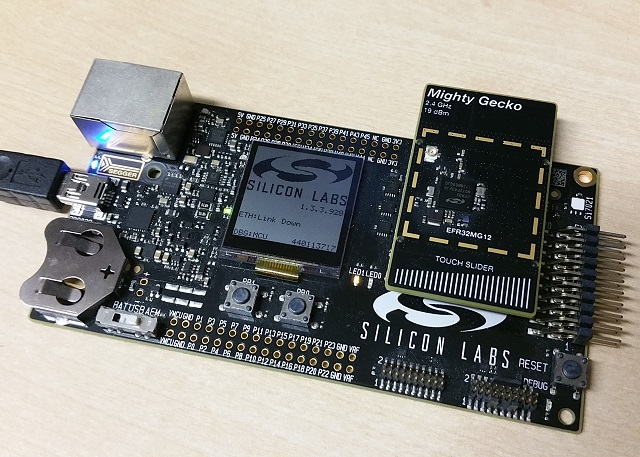

# OpenWeave EFR32 Lock Example Application

An example application showing the use of OpenWeave on the Silicon Labs EFR32 MG12 and MG21.

[OpenWeave](https://github.com/openweave/openweave-core/) is the open source release of Nest's Weave technology, an application layer framework that provides a secure, reliable communications backbone for Nest's products.

<hr>

* [Introduction](#intro)
* [Software Architecture](#software-architecture)
* [Example Application Design](#example-app-design)
* [Device UI](#device-ui)
* [Building](#building)
* [Initializing the EFR32 module](#initializing)
* [Flashing the Application](#flashing)
* [Viewing Logging Output](#view-logging)
* [Debugging with SEGGER Ozone](#debugging)

<hr>

<a name="intro"></a>

## Introduction



The EFR32 lock example application provides a working demonstration of a connected door lock device, built using OpenWeave, OpenThread and the Silicon Labs
gecko SDK. The example supports remote access and control of a simulated door lock over a low-power, 802.15.4 Thread network.  It is capable of being paired into
an existing Weave network along with other Weave-enabled devices, and supports communication (via a Weave border router device) with the Nest service.  The
example targets the Silicon Labs EFR32 SDK, but is readily adaptable to other EFR32-based hardware. 

The lock example is intended to serve both as a means to explore the workings of OpenWeave and OpenThread, as well as a template for creating real
products based on the Silicon Labs platform. 

The example application builds upon the [OpenWeave](https://github.com/openweave/openweave-core/) and [OpenThread](https://github.com/openthread/openthread)
projects, which are incorporated as submodules and built from source.  A top-level Makefile orchestrates the entire build process, including building OpenWeave,
OpenThread and select files from the Silicon Labs SDK.  The resultant image file can be flashed directly onto the Silicon Labs WSTK kit hardware.


<a name="software-architecture"></a>

## Software Architecture

 The lock example is built on the Weave application layer framework provided by [openweave-core](https://github.com/openweave/openweave-core/) . 
 At the heart of this are the **Weave Core** components.  These components provide the essential functionality required to speak Weave.
 This includes code for encoding and decoding Weave messages, communicating Weave messages over various transports (TCP, UDP, BLE), tracking
 Weave conversations (exchanges) and negotiating secure communications.

The **Weave Profiles** sit atop the core components and provide support for specific types of Weave interactions.  Central among these is the Weave Data
Management profile (**WDM**), which provides a generalized protocol for communicating state, configuration settings, commands and events between Weave
nodes.  Other profiles support device provisioning (pairing), OTA software update, time synchronization, and device identification and control.

The **Weave Device Layer** serves to adapt the portable Weave Core and Profile components to run in the context of a particular device platform.  In the case
of the lock example, the device platform is the EFR32 MG12 or MG21.  Additionally, the Device Layer also provides platform-neutral
services (APIs) to the application for performing certain fundamental operations that are common to all Weave devices.  These include managing a device’s
persistent configuration, managing its network connectivity, scheduling and orchestrating OTA software updates and others.

The lock example makes use of various components provided by the **Silicon Labs SDK**, including BLE support libraries, persistent storage management,
crypto services, logging and others.  **FreeRTOS** is used to support multi-threading and task synchronization.   **SEGGER RTT** support
provides access to log output using the J-Jink debug probe built in to the EFR32 Wireless Starter Kit (**WSTK**) Kit.  

**OpenThread** provides the core Thread stack implementation and manages persistent storage of Thread network configuration.  The **LwIP** Lightweight IP
stack provides IP services on top of Thread, including TCP, UDP and ICMPv6.

The **Silicon Labs EFR32 SDK** provides a BLE protocol stack and Dynamic Multiprotocol (**DMP**) support for simultaneous use of BLE and Thread.


<a name="example-app-design"></a>

## Example Application Design

The lock example application uses the Weave Data Management protocol (WDM) to enable remote access to state and control of a simulated door lock.  The
application implements the standard Nest-defined schema for a consumer-grade bolt lock.  In particular, the application publishes the `security.BoltLockTrait`, which
it uses to expose the overall state of the lock, and its bolt, to outside consumers.  In turn, the application consumes the properties of the `security.BoltLockSettingsTrait`
as published by the Nest service.  These properties contain user-supplied settings that configure the desired behavior of the device.

As part of implementing the BoltLockTrait, the application also responds to `BoltLockChangeRequest` commands instructing it to change the state of the bolt.  This
provides the ability to remotely lock and unlock the door.  To better simulate real lock hardware, the application incorporates a short delay mimicking the actuation
time of the bolt.

Whenever the state of the bolt changes, the application emits a `BoltActuatorStateChangeEvent`.  This event describes the end result of the change (bolt extended or
retracted), when the change happened and the actor or action that initiated it.  This is conveyed to the Nest service in a reliable manner.

Together, the features of the lock example have been designed to illustrate the four core interaction patterns typical of devices that use Weave and the
Weave Data Management protocol; namely:

- Publishing local state
- Subscribing to remote settings
- Reacting to received commands
- Emitting events


<a name="device-ui"></a>

## Device UI

The example application provides a simple UI that depicts the state of the device and offers basic user control.  This UI is implemented via the general-purpose
LEDs and buttons built in to the EFR32 WSTK development board.

**LED #0** shows the overall state of the device and its connectivity.  Four states are depicted:

- *Short Flash On (50ms on/950ms off)* &mdash; The device is in an unprovisioned (unpaired) state and is waiting for a commissioning application to connect.


- *Rapid Even Flashing (100ms on/100ms off)* &mdash; The device is in an unprovisioned state and a commissioning application is connected via BLE.


- *Short Flash Off (950ms on/50ms off)* &mdash; The device is full provisioned, but does not yet have full network (Thread) or service connectivity.


- *Solid On* &mdash; The device is fully provisioned and has full network and service connectivity.


**Button PB0** can be used to initiate a OTA software update as well as to reset the device to a default state. 

A brief press of Button PB0 instructs the device to perform a software update query to the Nest service.  Should the service indicate a software update is  available, the device
will download the corresponding software image file.  This feature is only available once the device completed the pairing process. While software update is running, another brief press on Button PB0 will abort it.

Pressing and holding Button PB0 for 6 seconds initiates a factory reset.  After an initial period of 3 seconds, all four LED will flash in unison to signal the pending reset.  Holding the button past 6 seconds will cause the device to reset its persistent configuration and initiate a reboot.  The reset action can be cancelled by releasing the button at any point before the 6 second limit.

**LED #1** shows the state of the simulated lock bolt.  When the LED is lit the bolt is extended (i.e. door locked); when not lit, the bolt is retracted (door unlocked).  The LED will flash whenever the simulated bolt is in motion from one position to another.

**Button PB1** can be used to change the state of the simulated bolt.  This can be used to mimick a user manually operating the lock.  The button behaves as a toggle, swapping the state every time it is pressed.


<a name="building"></a>

## Building

* Download and install the [Silicon Labs Simplicity Studio and SDK for Thread and Zigbee version v2.7] (https://www.silabs.com/products/development-tools/software/simplicity-studio)

Extract the SimplicityStudio-v4.tgz archive to where you want to install Simplicity Studio and follow the instructions in README.txt found within the extracted archive to complete installation.  The remaining instructions assume SimplicityStudio_v4 is installed in the user's home directory.

In Simplicity Studio from the Launcher perspective click on the "Update Software" button.  The Package Manager window will Open.  Ensure that the following SDKs are installed (as of January 2020).
  
  * Bluetooth 2.13.0.0
  * Flex 2.7.0.0

* Download and install a suitable ARM gcc tool chain: [GNU Arm Embedded Toolchain 7-2018-q2-update](https://developer.arm.com/open-source/gnu-toolchain/gnu-rm/downloads/7-2018-q2-update)
(Direct download link: 
[Linux](https://developer.arm.com/-/media/Files/downloads/gnu-rm/7-2018q2/gcc-arm-none-eabi-7-2018-q2-update-linux.tar.bz2) 
[Mac OS X](https://developer.arm.com/-/media/Files/downloads/gnu-rm/7-2018q2/gcc-arm-none-eabi-7-2018-q2-update-mac.tar.bz2)) 

* Install some additional tools:

         # Linux
         $ sudo apt-get install git make automake libtool ccache
         
         # Mac OS X
         $ brew install automake libtool ccache

* Clone the example application into the app subdirectory of the v2.7 SDK

         $ cd ~/SimplicityStudio_v4/developer/sdks/gecko_sdk_suite/v2.7/app
         $ git clone https://github.com/SiliconLabs/openweave-efr32-lock-example.git

         $ cd openweave-efr32-lock-example
         $ git submodule update --init

* To build for an MG21 part make the following changes to the platform/CMSIS/Include/core_cm33.h file within the Silicon Labs SDK.
Copy the following lines to the top of the core_cm33.h file.

```cpp
#if defined(__GNUC__)
#pragma GCC diagnostic ignored "-Wpedantic"
#endif
```

* Supported hardware:

    MG12 boards:
    
    - BRD4161A / SLWSTK6000B / Wireless Starter Kit / 2.4GHz@19dBm
    - BRD4166A / SLTB004A / Thunderboard Sense 2 / 2.4GHz@10dBm
    - BRD4170A / SLWSTK6000B / Multiband Wireless Starter Kit / 2.4GHz@19dBm, 915MHz@19dBm
    - BRD4304A / SLWSTK6000B / MGM12P Module / 2.4GHz@19dBm

    MG21 boards:
    
    - BRD4180A / SLWSTK6006A / Wireless Starter Kit / 2.4GHz@20dBm

         
* Build the openweave-ef32-example-lock application:

         $ make BOARD=BRD4161A


* To delete generated executable, libraries and object files use:

         $ make BOARD=BRD4161A clean


<a name="initializing"></a>

## Initializing the EFR32 module

The example application is designed to run on the Silicon Labs SDK development kit.  Prior to installing
the application, the device's flash memory should be erased.

* Connect the host machine to the J-Link Interface MCU USB connector on the EFR32 WSTK.

* Use the Makefile to erase the flash:

        $ make BOARD=BRD4161A erase        

* To erase a specific device using its serial number:

        $ make BOARD=BRD4161A SERIALNO=440113717 erase  


<a name="flashing"></a>

## Flashing the Application

* To rebuild the image and flash the example app:

        $ make BOARD=BRD4161A flash

* To rebuild the image and flash a specific device using its serial number:

        $ make BOARD=BRD4161A SERIALNO=440113717 flash 

* To flash an existing image without rebuilding:

        $ make BOARD=BRD4161A flash-app


<a name="view-logging"></a>

## Viewing Logging Output

The example application is built to use the SEGGER Real Time Transfer (RTT) facility for log output.  RTT is a feature built-in to the J-Link Interface MCU on the WSTK development board. It allows bi-directional communication with an embedded application without the need for a dedicated UART.

Using the RTT facility requires downloading and installing the *SEGGER J-Link Software and Documentation Pack* ([web site](https://www.segger.com/downloads/jlink#J-LinkSoftwareAndDocumentationPack)).  Alternatively the *SEGGER Ozone - J-Link Debugger* can be used to view RTT logs.

* Download the J-Link installer by navigating to the appropriate URL and agreeing to the license agreement. 

 * [JLink_Linux_x86_64.deb](https://www.segger.com/downloads/jlink/JLink_Linux_x86_64.deb)
 * [JLink_MacOSX.pkg](https://www.segger.com/downloads/jlink/JLink_MacOSX.pkg)


* Install the J-Link software

        $ cd ~/Downloads
        $ sudo dpkg -i JLink_Linux_V*_x86_64.deb

* In Linux, grant the logged in user the ability to talk to the development hardware via the linux tty device (/dev/ttyACMx) by adding them to the dialout group.

        $ sudo usermod -a -G dialout ${USER} 

Once the above is complete, log output can be viewed using the JLinkExe tool in combination with JLinkRTTClient as follows:

* Run the JLinkExe tool with arguments to autoconnect to the WSTK board:

    For MG12 use:
        
        $ JLinkExe -device EFR32MG12PXXXF1024 -if JTAG -speed 4000 -autoconnect 1

    For MG21 use:

        $ JLinkExe -device EFR32MG21AXXXF1024 -if SWD -speed 4000 -autoconnect 1

* In a second terminal, run the JLinkRTTClient to view logs:

        $ JLinkRTTClient
        
                
<a name="debugging"></a>

## Debugging with SEGGER Ozone

The SEGGER Ozone J-Link Debugger is a full featured debugger and Real-Time-Telemetry (RTT) viewer that is available for Linux and macOS.

* Download and install SEGGER Ozone Debugger:

[SEGGER Ozone J-Link Debugger](https://www.segger.com/products/development-tools/ozone-j-link-debugger)

* Enable debugging with the DEBUG=1 switch in the make command, e.g.

         $ make BOARD=BRD4161A DEBUG=1
         
* Start SEGGER Ozone Debugger:
  
         $ /opt/SEGGER/ozone/<version>/Ozone
         
* Open the New Project Wizard, either from the File->New menu or the Dialog Box that appears at startup.

  * Target Device
    Set Device to Cortex-M4 for MG12, Cortex-M33 for MG21

  * Connection Settings.
    Select JTAG for MG12, SWD for MG21, 4Mhz Target Interface Speed
  
  * Program File
    Select ~/openweave-efr32-lock-example/build/openweave-efr32-lock-example.elf
    
* Select the Start Debugging->Attach to Running Program from the Debug menu. After a short delay the debugger will connect to the device.

* To view RTT Log output, ensure the Terminal pane is enabled from the View menu.

* Confirm RTT is working from the J-Link Control Panel.

  * Open the J-Link Control Panel pane from the View menu.
  * Click on the RTT tab button at the top of the J-Link Control Panel
  * The Status field shall show Located RTT Control Block
  
If the control block cannot be found open the Global Data pane from the View menu.

The top line of the Global Data pane is a search box. Search for \_SEGGER\_RTT. Copy its location into the Control Block Address text box in the J-Link Control Panel and click the Start button in the J-Link Control Panel.


